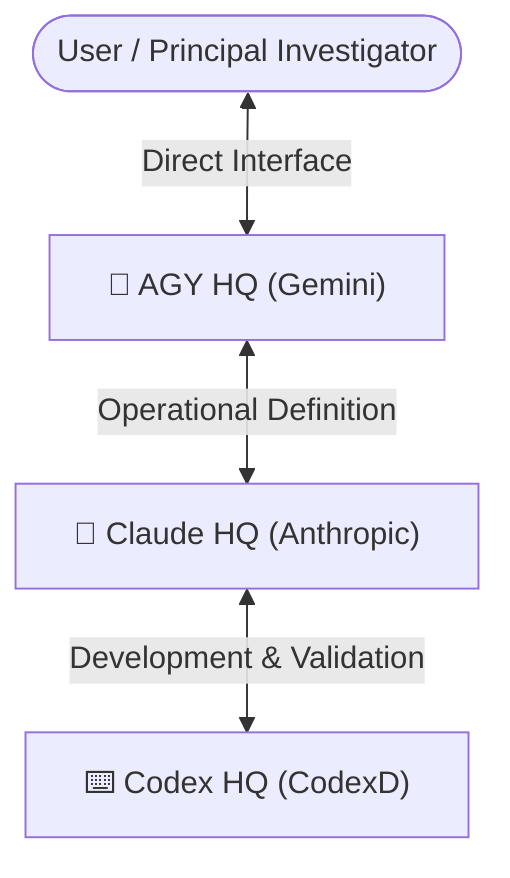

# 🏢 Multi-Agent Headquarters System Config

This directory holds the configuration, prompts, and guidelines for the **DM_WHTR** Multi-Agent system. The system is split into three main Headquarters, each specializing in a distinct section of the project lifecycle.

## 📐 Architecture & Role Hierarchy



### 1. [🚀 AGY Headquarters (SPoC, Orchestrator, DevOps)](file:///mnt/h/dm_whtr/agents/agy_hq_prompt.md)
- **Role**: SPoC, controller, pipeline engineer, and documenter.
- **Key Duties**:
  - Enforce the **"메시지 전송 보류 원칙" (Message Suspend Policy)** to prevent task interruption.
  - Establish environment compliance (Windows 10/11, Python 3.12, air-gapped package wheelhouse installation).
  - Manage SAP HANA CP949 data extraction pipelines (`extract_hana.py`).
  - Maintain Obsidian logs automatically.

### 2. [🧩 Claude Headquarters (Epidemiology, QA, Ethics)](file:///mnt/h/dm_whtr/agents/claude_hq_prompt.md)
- **Role**: Scientific director and quality control auditor.
- **Key Duties**:
  - Define precise mathematical cohort filtration parameters (Wash-out, Lag-time, BMI $\ge 25$, WHtR $\ge 0.5$ matrix).
  - Review code for mathematical and biostatistical validity (Cox Proportional Hazards assumptions, Schoenfeld Residuals tests).
  - Verify complete data de-identification and mitigate competing risks.

### 3. [⌨️ Codex Headquarters (Code Builder, TDD)](file:///mnt/h/dm_whtr/agents/codex_hq_prompt.md)
- **Role**: Ultra-high-speed code constructor and tester.
- **Key Duties**:
  - Author robust, platform-independent statistics code under strict Windows/Python 3.12 limits.
  - Implement full TDD unit testing scripts (`test_cohort_pipeline.py`, `test_analysis_pipeline.py`).
  - Construct NHIS-grade synthetic SQLite database simulators (`generate_synthetic_db.py`).

---

## 📡 Dynamic Invocation Guidelines

To invoke a specific headquarters in the CLI agent framework, call the subagent:

1. **Invoke AGY HQ**:
   ```json
   {
     "TypeName": "agy_hq",
     "Role": "Orchestration & DevOps",
     "Prompt": "Request a tasks scheduling overview or trigger DevOps offline packaging checks."
   }
   ```

2. **Invoke Claude HQ**:
   ```json
   {
     "TypeName": "claude_hq",
     "Role": "Scientific Architect & QA",
     "Prompt": "Request cohort operational definitions design or statistical code review (Schoenfeld Residual test verification)."
   }
   ```

3. **Invoke Codex HQ**:
   ```json
   {
     "TypeName": "codex_hq",
     "Role": "High-Speed Code Builder",
     "Prompt": "Construct a synthetic dataset schema or generate a lifelines Cox proportional hazards calculation script."
   }
   ```
